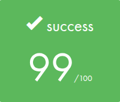

  

> ⚠️ **Important notice for 42 students**  
> This repository is intended as a reference and for educational purposes **only**.  
> Directly copying, submitting, or presenting this code as your own work in the 42 curriculum is a violation of the school's academic integrity policy and may result in disciplinary action.  
>  
> Feel free to read, learn, and get inspired — but always write your own code.

## 🎓 Grade

## 📘 Description
**CPP Module 00** is the first step in the C++ modules series from 42.  
It introduces you to the basics of the C++ language and helps you transition from C to C++.  
This module focuses on understanding object-oriented programming concepts, syntax differences with C, and simple class manipulation.

## 🧠 Key Concepts
- **Namespaces**
- **Classes** and **member functions**
- **Access specifiers** (`public`, `private`)
- **std::string** manipulation
- **iostream** usage (`std::cout`, `std::cin`)
- **Compiling with `-std=c++98`**

## 📂 Exercices
The module is split into 3 exercises:
1. **Megaphone** – Basic string manipulation and output.
2. **PhoneBook** – Implementation of a simple contact manager using classes.
3. **Account** – Simulation of a banking system with class members.
