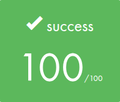
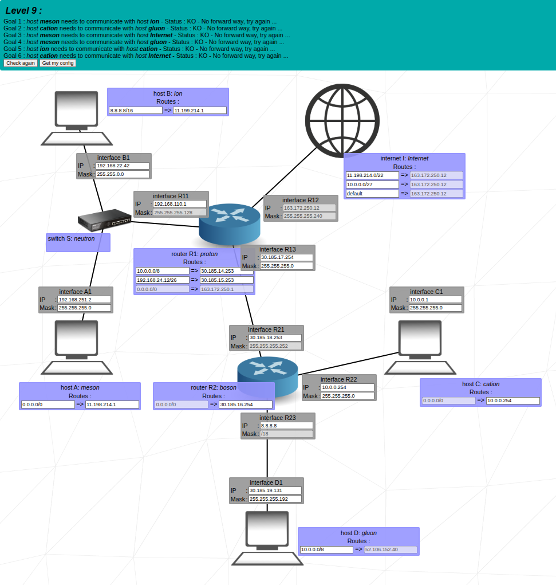

  

## 🎓 Grade

## 📘 Description

**NetPractice** is a theoretical and practical project to teach the fundamentals of **computer networks**.  
It takes place in a browser-based simulation platform where you must solve network configuration problems by analyzing and correcting IP setups across various devices.

You'll learn to configure IP addresses, subnet masks, and routing in order to ensure successful communication between devices in a simulated network environment.

## 🧠 Key Concepts

- IPv4 addressing
- Subnetting and netmasks
- CIDR notation
- Routing basics (static routing)
- Network troubleshooting
- Device communication logic (PCs, routers, switches)

## 🚀 Usage

> Note: This project doesn’t require coding or a local repository. All tasks are performed within the browser-based simulation tool provided by 42.

## 🎥 Demo

First make the project, then:  

