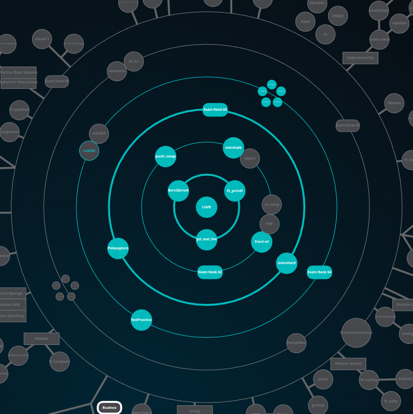

# Common Core Projetcs

This repository contains all the projects I completed during the **common core** at **[42 School](https://42.fr/en/homepage/)**.

> ⚠️ **Important notice for 42 students**  
> This repository is intended as a reference and for educational purposes **only**.  
> Directly copying, submitting, or presenting this code as your own work in the 42 curriculum is a violation of the school's academic integrity policy and may result in disciplinary action.  
>  
> Feel free to read, learn, and get inspired — but always write your own code.

## 💡 About 42 School

**[42](https://42.fr/en/homepage/)** is a **tuition-free**, **project-based**, and **peer-to-peer learning** computer science school, which is part of the global **[42 Network](https://www.42network.org/)**, with **50+ campuses worldwide**.

42’s innovative pedagogy is **100% hands-on**: there are no teachers, no classes, and no traditional schedule. Students learn through **collaborative projects**, **problem-solving**, and **self-paced work**, 24/7. The curriculum covers **algorithms, systems programming, web development, AI, cybersecurity**, and more, preparing students for careers in tech with a strong focus on **practical skills** and **adaptability**.

The **common core** (tronc commun) is the foundational part of the program, where students master **C/C++ programming, Unix, data structures, and low-level programming**, among other essential skills.

The various projects must be validated in the order of the ***‘Holy Graph’*** :

*For more information about 42’s unique approach, visit [42’s official website](https://www.42.fr/).*

## 📘 Description
 
Each project folder includes source code, resources, and a dedicated `README.md` detailing the objectives, key concepts, and usage.

## 📑 Project Overview - Organized by rank

| Rank | Project | Languages & Technologies | Hours | Type | Description | Grade /100 |
|:------:|:---------:|:----------:|:-------:|:------:|:-------------:|:--------:|
| **00** | [**libft**](./libft) |  |  |  | Implementation of a custom C standard library |  |
| | | | | | | | 
| **01** | [**born2beroot**](./born2beroot) |   |  |  | Virtual machine setup & system administration |  |
| **01** | [**ft_printf**](./ft_printf) |  |  |  | Recreation of the `printf` function in C |  |
| **01** | [**get_next_line**](./get_next_line) |  |  |  | Function to read a line from a file descriptor |  |
| | | | | | | | 
| **02** | [**fract-ol**](./fract-ol) |   |  |  | Fractal rendering using MiniLibX |  |
| **02** | [**minitalk**](./minitalk) |   |  |  | Client-server communication via UNIX signals |  |
| **02** | [**push_swap**](./push_swap) |   |  |  | Sorting data on a stack with limited instructions |  |
| | | | | | | | 
| **03** | [**philosophers**](./philosophers) |   |  |  | Dining Philosophers problem with multithreading |  |
| **03** | [**minishell**](./minishell) |   |  |  | Recreation of a basic shell |  |
| | | | | | | | 
| **04** | [**cub3D**](./cub3D) |   |  |  | Network configuration exercises |  |
| **04** | [**NetPractice**](./NetPractice) |  |  |  | Network configuration exercises |  |
| **04** | [**CPP00**](./CPP00) |  |  |  | First approach to C++ |  |
| **04** | [**CPP01**](./CPP01) |  |  |  | Memory allocation, references, pointers to members, and the use of switch |  |
| **04** | [**CPP02**](./CPP02) |  |  |  | Polymorphism, overloading, and orthodox canonical classes |  |
| **04** | [**CPP03**](./CPP03) |  |  |  | Inheritance |  |
| **04** | [**CPP04**](./CPP04) |  |  |  | Subtype polymorphism, abstract classes and interfaces |  |
| | | | | | | | 
| **05** | [**CPP05**](./CPP05) |  |  |  | Try/Catch functions and exceptions |  |
| **05** | [**CPP06**](./CPP06) |  |  |  | Different casts |  |
| **05** | [**CPP07**](./CPP07) |  |  |  | Templates |  |
| **05** | [**CPP08**](./CPP08) |  |  |  | Template containers, iterators and algorithms |  |
| **05** | [**CPP09**](./CPP09) |  |  |  | Containers |  |
| **05** | [**webserv**](./webserv) |   |  |  | Build HTTP server |  |
| **05** | [**Inception**](./Inception) |       |  |  | Virtualise multiple Docker images with a custom VM |  |
| | | | | | | | 
| **06** | [**ft_transcendence**](./ft_transcendence) |    |  |  | Rewrite the Pong game on a multiplayer web page |  |
