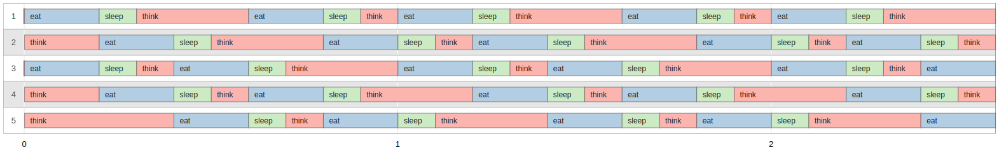

# Philosophers

<div align="center">


  

</div>

## Grade


## Description

Philosophers is an implementation of the classic "Dining Philosophers Problem," which demonstrates the challenges of concurrency and synchronization. The project is based on the scenario where several philosophers are sitting around a table, alternating between eating and thinking. The goal is to properly manage **mutexes** to prevent deadlock and ensure correct synchronization of philosopher actions.

This project showcases the use of **C threads (pthreads)** to simulate parallel actions while avoiding resource conflicts.

## Features

- **Simulate dining philosophers**: A configurable number of philosophers, each represented by a thread.
- **Resource management**: Philosophers share forks, and it’s essential to prevent deadlock by correctly managing access to resources.
- **Synchronization algorithms**: The program uses mutexes to synchronize philosopher actions and prevent race conditions.

## Demo

Here’s a screenshot of the program after running `./philo 5 1000 200 100 5`:



> Visual generated using this [Philosophers Visualizer](https://nafuka11.github.io/philosophers-visualizer/)


## Usage

To run the program, run:


```bash
make
./philo [number_of_philosophers] [time_to_eat] [time_to_sleep] [time_to_wait]
```