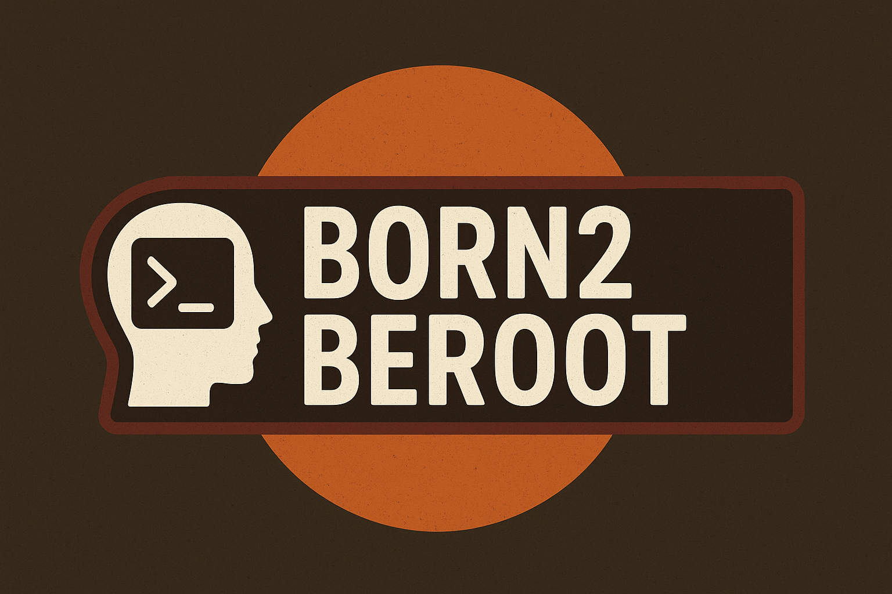
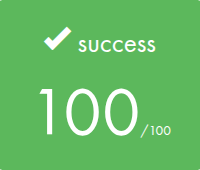

  

## 🎓 Grade

## 📘 Description

**Born2beroot** is a system administration and cybersecurity project.
The goal is to create a secure, functional, and minimal virtual machine based on **Debian**, applying best practices in system hardening, user management, and service configuration
This project introduces to **Linux system administration**, **virtualization**, **firewall configuration**, **secure SSH**, and **basic automation** using shell scripting.

## 🧩 Project Goals

- Install and configure a virtual machine (Debian)
- Harden the OS using security best practices
- Set up a strong user policy with secure sudo rules
- Configure key services (SSH, UFW, sudo, hostname, etc.)
- Automate configurations (e.g., via scripts or configuration files)
- Ensure compliance with **42's auditing checklist**

## 🖥️ System Requirements

- Virtual Machine: **Debian**
- Virtualization: VirtualBox
- At least **2 users**: `root` and a sudo-capable user
- Strong password policies
- Sudo configured with **password expiration and restrictions**
- SSH access with security settings (port, protocol, etc.)
- Hostname and static IP configuration
- UFW (Debian) setup
- Service monitoring with `cron` and custom scripts
- Security audits via `ufw`, `apt`, etc.
