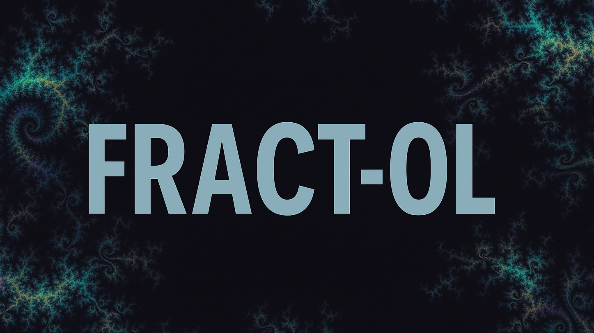
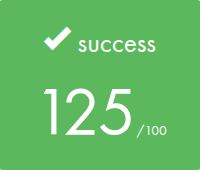

<div align="center">

  


</div>

> ⚠️ **Important notice for 42 students**  
> This repository is intended as a reference and for educational purposes **only**.  
> Directly copying, submitting, or presenting this code as your own work in the 42 curriculum is a violation of the school's academic integrity policy and may result in disciplinary action.  
>  
> Feel free to read, learn, and get inspired — but always write your own code.

## 🎓 Grade


## 📘 Description

**fract-ol** is a graphical programming project from the 42 curriculum, where the goal is to render fractals in real time using the [MiniLibX](https://github.com/42paris/minilibx-linux) graphics library.

It involves generating mathematically complex fractals like **Mandelbrot**, **Julia**, and **Lotus**, and displaying them in a responsive, interactive window with zoom and color manipulation. This project enhances your understanding of algorithms, math, and event-driven programming in C.

## 🧠 Key Concepts

- Complex numbers and 2D coordinates
- Fractal generation algorithms (Mandelbrot, Julia, etc.)
- Event handling (keyboard & mouse input)
- Pixel drawing with [MiniLibX](https://github.com/42paris/minilibx-linux)
- Zoom, pan, color mapping
- Image refreshing
- Multithreading (`bonus` part)

## 🚀 Usage

1. Build the project:

```bash
make        # For the mandatory part
make bonus  # For the bonus part
```

2. Run the fractal viewer:

*Usage:* `./fract-ol [-mt/-h/mandelbrot/lotus/julia [cx cy]]`
```bash
# Exemples
./fractol mandelbrot
./fractol_bonus -mt julia -0.75 0

# For help
./fractol -h 
./fractol_bonus -h
```

3. Controls:

| Input                     | Action                          |
|---------------------------|---------------------------------|
| `P` / `M` or Mouse Scroll | Zoom in/out                     |
| Arrows                    | Move across the fractal         |
| `W` / `Q`                 | Increase or decrease iterations |
| `C`                       | Cycle through color palettes    |
| `R`                       | Reset view to default           |
| `ESC`                     | Quit the application            |

4. Clean build files:
```bash
make clean      # Removes object files  
make fclean     # Removes object files and binary  
make re         # Rebuilds everything from scratch
```

## 🎥 Demo

First `make bonus` the project, then run `./fractol_bonus mandelbrot`:  


