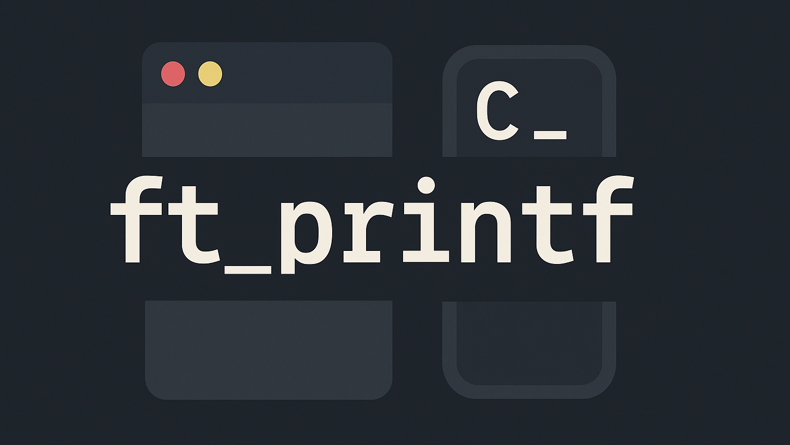

<div align="center">

  


</div>

## 🎓 Grade


## 📘 Description

**ft_printf** is a custom implementation of the standard `printf` function in C.  
It reproduces formatted output using a restricted set of tools — without calling the original `printf`.  
The project teaches formatted output, variadic functions, buffer and memory handling, and modular design.

The supported format specifiers include `%c`, `%s`, `%d`, `%i`, `%u`, `%x`, `%X`, `%p`, and `%%`.

## 🧠 Key Concepts

- Variadic functions with `<stdarg.h>`
- Format string parsing
- Integer and pointer base conversions
- Character and string formatting
- Output to standard output using `write`
- Memory-safe design with no leaks

## 🚀 Usage

1. Build the library:
```
make
```

2. Compile your program with it:
```
gcc your_file.c -L. -lftprintf
```

3. Clean build files:
```bash
make clean      # Removes object files  
make fclean     # Removes objects and the library  
make re         # Rebuilds everything
```
