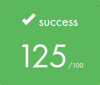

<div align="center">

  
 


</div>

## 🎓 Grade


## 📘 Description

**libft** is the first project of the 42 Common Core curriculum.  
It consists of recreating a set of essential C standard library functions from scratch, in order to strengthen your understanding of low-level programming, memory management, and code architecture.

All functions follow the strict 42 Norme and avoid the use of any external libraries (except `malloc`, `free`, and `write`).

## 🧠 Key Concepts

- Manual memory management in C
- String and character operations
- Pointer arithmetic
- Function modularity and static libraries
- Custom linked list implementation (`bonus`)
- Clean code following strict guidelines

## 🚀 Usage

1. Build the static library:
```
make
```

2. Use it in your own project:
```
gcc main.c -L. -lft
```

3. Clean build files:
```bash
make clean      # Removes object files  
make fclean     # Removes object files and libft.a  
make re         # Rebuilds everything from scratch
```
