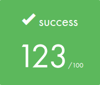

<div align="center">


</div>

> ⚠️ **Important notice for 42 students**  
> This repository is intended as a reference and for educational purposes **only**.  
> Directly copying, submitting, or presenting this code as your own work in the 42 curriculum is a violation of the school's academic integrity policy and may result in disciplinary action.  
>  
> Feel free to read, learn, and get inspired — but always write your own code.

## 🎓 Grade


## 📘 Description
**Minishell** is a simplified shell implementation written in C, developed as part of the 42 school curriculum with [SiliconMoloch](https://github.com/SiliconMoloch).  
The aim of this project is to create a small yet functional shell capable of parsing and executing commands, managing environment variables, and handling essential shell features.  
We also implemented the **bonus part**, including logical operators (`&&`, `||`) using a binary tree parser, and wildcard (`*`) expansion.

## 🧠 Key Concepts
- **Command parsing** and tokenization
- **Execution flow control** with `&&` and `||` (binary tree parsing)
- **Wildcard expansion** for filename matching
- **Pipes** (`|`) and redirections (`<`, `>`, `>>`, `<<`)
- **Environment variables** management (`export`, `unset`)
- **Signal handling** (`SIGINT`, `SIGQUIT`)
- **Built-in commands** (`cd`, `echo`, `pwd`, `exit`, etc.)
- **Process creation** with `fork()` and `execve()`
- **Error handling** and exit codes
- **Memory management** and resource cleanup with garbage collector

## 🚀 Usage

1. Build the project:

```bash
make        # For the mandatory part
make bonus  # For the bonus part
```

2. Run the shell:

```bash
./minishell        # For the mandatory part
./minishell_bonus  # For the bonus part
```

3. Exit with `Ctrl-D` or:

```bash
exit
```

## 🎥 Demo

First `make` the project, then:


## 🤝 Collaborators
- [SiliconMoloch](https://github.com/SiliconMoloch) (FR)
