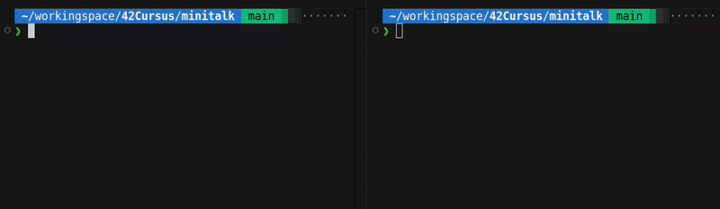

  

## 🎓 Grade

## 📘 Description

**minitalk** is a project focused on inter-process communication (IPC) using **UNIX signals**.  
The goal is to build a simple client-server system where messages are sent one bit at a time using only `SIGUSR1` and `SIGUSR2`.

This project demonstrates how to encode characters as binary signals, set up signal handlers, and ensure reliable communication between independent processes.

## 🧠 Key Concepts

- Inter-process communication (IPC)
- Signal handling in Unix (with `signal()` or `sigaction()`)
- Bitwise operations
- Asynchronous event management
- Encoding/decoding characters via signals
- Memory and timing safety

## 🔧 How It Works

- A **server** is launched and displays its PID.
- A **client** sends a string message to the server.
- Each character is sent **bit by bit**, using `SIGUSR1` for binary `1` and `SIGUSR2` for binary `0`.
- The server reconstructs the characters and prints the message.

## 🎥 Demo

First `make` the project, then:

