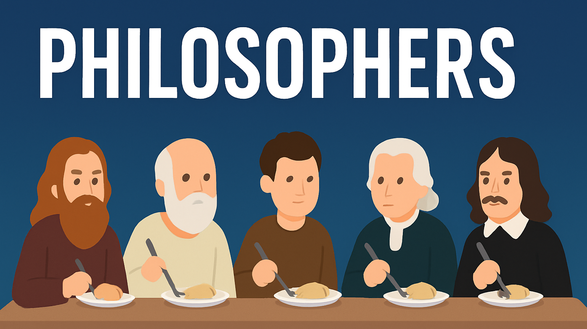
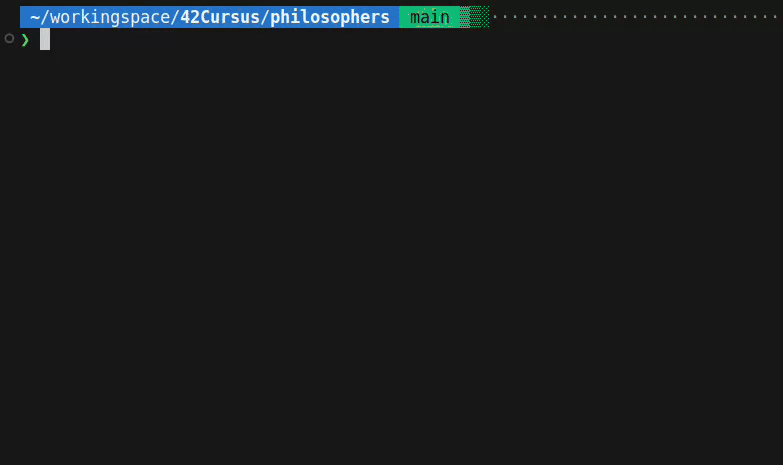
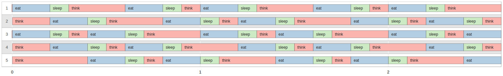

<div align="center">

  


</div>

## 🎓 Grade


## 📘 Description

**philosophers** is a concurrency-focused project that challenges you to implement the classic **Dining Philosophers Problem**, a well-known example in concurrency theory.  
Using **POSIX threads and mutexes**, the project requires simulating the behavior of philosophers who must think, eat, and sleep without causing **deadlocks**, **race conditions**, or **starvation**.

## 🧠 Key Concepts

- POSIX threads (`pthread`)
- Mutex synchronization (`pthread_mutex`)
- Deadlock prevention
- Timing accuracy (`gettimeofday`, `usleep`)
- State management and shared data access

## 🚀 Usage

1. Build the project:
```
make
```

2. Run the program:
```bash
./philo [number_of_philosophers] [time_to_die] [time_to_eat] [time_to_sleep]

# Exemple
./philo 5 800 200 200
```

3. Clean build files:
```bash
make clean      # Remove object files  
make fclean     # Remove objects and binaries  
make re         # Rebuild everything
```

## 🎥 Demo

First `make` the project, then run `./philo 5 1000 200 100 5`:  





> Visual generated using this [Philosophers Visualizer](https://nafuka11.github.io/philosophers-visualizer/)

