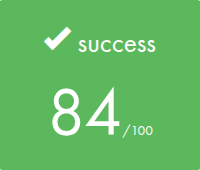
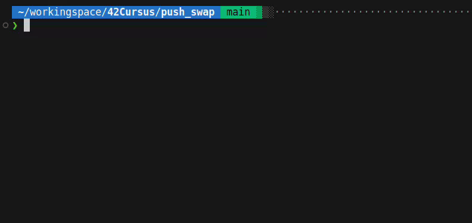

<div align="center">

  


</div>

## 🎓 Grade


## 📘 Description

**push_swap** is an algorithmic project, where the goal is to sort a stack of integers using a very limited set of stack operations and with the fewest moves possible.  
You must write a program that generates a list of operations, and a checker program that verifies whether those operations correctly sort the stack.

This project teaches low-level data structures, sorting algorithms, complexity optimization, and input validation in pure C.

## 🧠 Key Concepts

- Stack-based sorting with limited operations (`sa`, `pb`, `ra`, etc.)
- Doubly or singly linked lists
- Input parsing and error handling
- Algorithm design (radix sort, insertion sort, quick sort strategies)
- Time and space complexity awareness
- Writing a checker to validate your output

## 🚀 Usage

1. Build the project:
```
make
```

2. Run the `push_swap` program:
```
./push_swap 8 67 3 87 23
```

This will output a list of instructions to sort the numbers using two stacks.

3. Test the output with the `checker_linux` (*only for linux*) program:
```
./push_swap 3 2 1 | ./checker_linux 3 2 1
```

If everything is correct, it should print `OK`.  
Otherwise, it should print `KO`.

4. Clean build files:
```
make clean      # Removes object files  
make fclean     # Removes objects and binaries  
make re         # Rebuilds everything
```

## 🎥 Demo

First `make` the project, then:  

